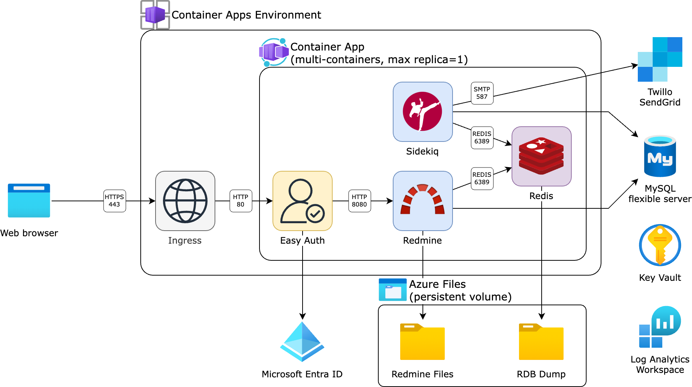

# Redmine on Azure Container Apps

## Introduction

DX2 DevOps solution for [Redmine] or [RedMica] on [Azure Container Apps].

- containers
  - [redmine](containers/redmine) ... Redmine/RedMica container
- azd ([Azure Developer CLI])
  - [env](azd/env) ... Shared env resources: Azure Database for MySQL/PostgreSQL (flexible server)
  - [app](azd/app) ... App resources: Azure Container App, Storage Account, etc.

[Redmine]: https://github.com/redmine/redmine
[RedMica]: https://github.com/redmica/redmica
[Azure Container Apps]: https://learn.microsoft.com/en-us/azure/container-apps/overview
[Azure Developer CLI]: https://learn.microsoft.com/en-us/azure/developer/azure-developer-cli/overview

## Architecture

> 
