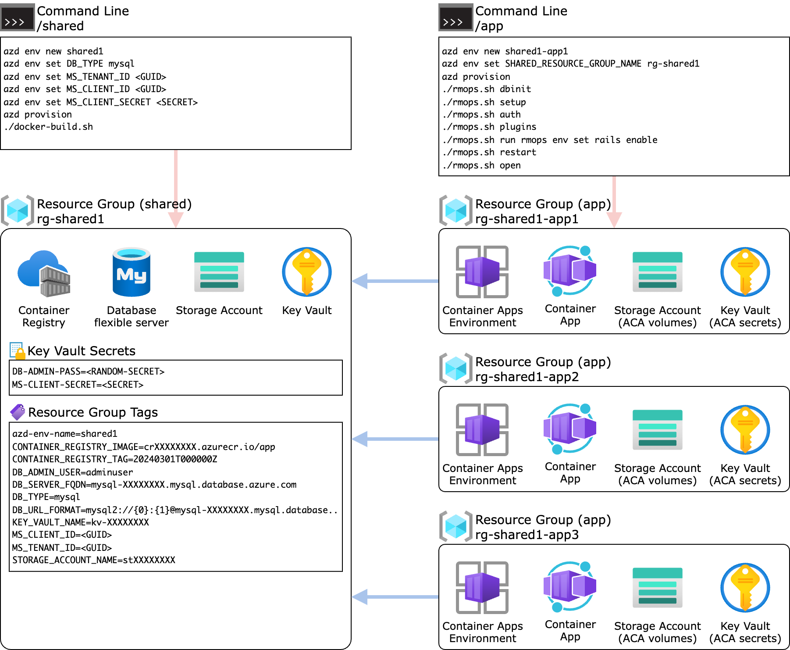

# Redmine on Azure Container Apps

## Introduction

DX2 DevOps solution for [Redmine] or [RedMica] on [Azure Container Apps][ACA] using the [Azure Developer CLI][AZD] (AZD).

- [shared](shared) ... AZD project for shared resources: Azure Database for MySQL/PostgreSQL (flexible server), Azure Container Registry, etc.
  - [redmine](shared/redmine) ... Shared Redmine app container
- [app](app) ... AZD project for app resources: Azure Container App, Storage Account, etc.

[Redmine]: https://github.com/redmine/redmine
[RedMica]: https://github.com/redmica/redmica
[ACA]: https://learn.microsoft.com/en-us/azure/container-apps/overview
[AZD]: https://learn.microsoft.com/en-us/azure/developer/azure-developer-cli/overview

## Architecture

### Solution overview

> 

### Authentication overview

> 

### Deployment overview

> 
